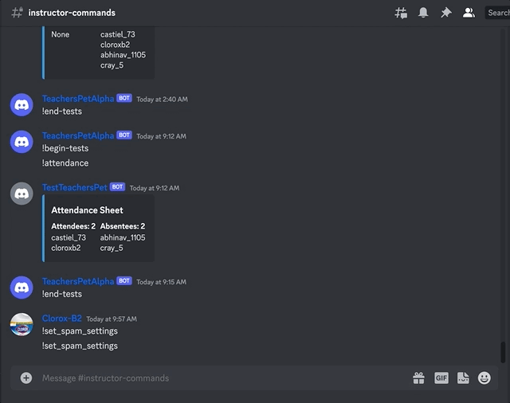
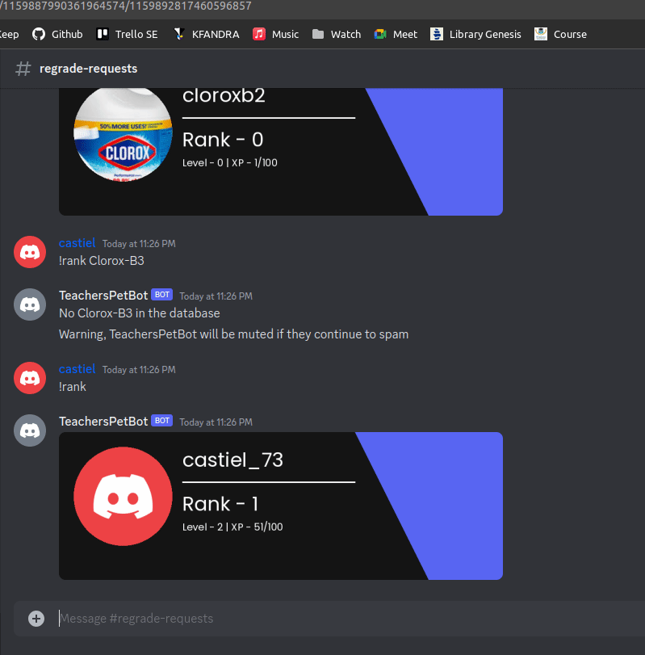
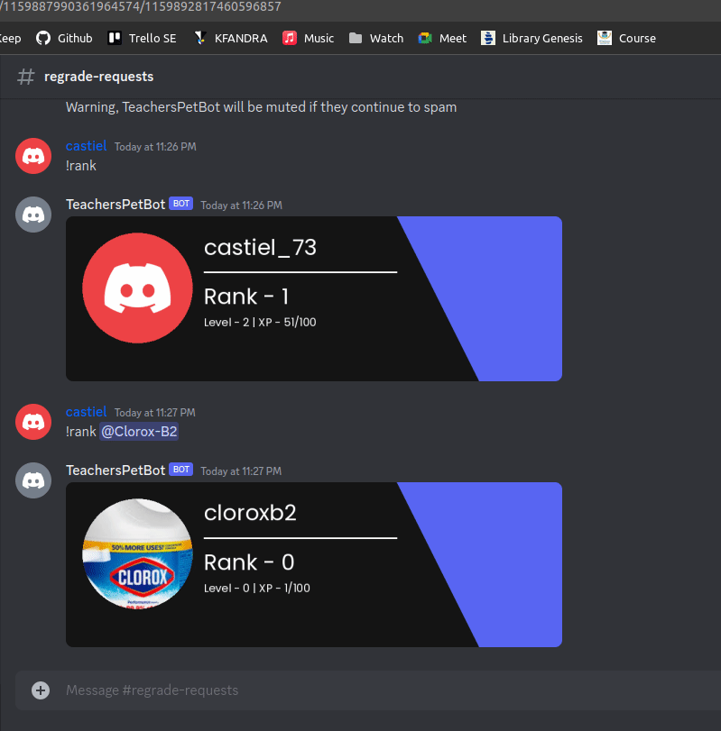

  
  <h1 align="center"> Teacher's Pet </h1>
  
<h2 align="center"> Streamline Your Class Discord</h2>

<!-- I am not sure about this parameter yet. Any idea what to do about this? -->
<!--   -->

## Contents
1. [ Description ](#desc)
2. [ New Features](#features)
3. [ Installation and Running ](#instrun)
4. [ Testing ](#testing)
5. [ Bot Commands ](#commands)
6. [ Future Scope ](#fscope)
7. [ Want to contribute? ](#contribute)
8. [ License ](#license)

Click Below to Watch The Video!

  

https://youtu.be/wzObedlYgho

  
<h2>Software Engineering Project for CSC 510 : Phase IV</h2>

Teacher's Pet is a Discord Bot for class instructors to streamline their Discord servers. Discord is a great tool for communication and its functionalities can be enhanced by bots and integrations. 

For 4.0, we created new tools for instructors and students to use to improve course communication. After version 3.0's success, we decided we wanted to improve upon some of its features including spam and saved links. We also wanted to add a few more exciting features that would really drive engagement with our bot, for example, the AI chat and student ranking feature. Our main objective for 4.0 was to make using Discord a more controlled and enjoyable experience.

<h2>Bot Features</h2>

[Click here to see the features of iterations I, II and III.](docs/feature-history.md)

<h4>Bard AI</h4>
Experience the power of AI and engage in informative and creative conversations with Bard through our !Aichat feature. Ask questions, spark creativity, and enjoy intelligent interactions—all at your fingertips.
Google Bard can answer your questions, generate text, translate languages, and write different kinds of creative content.
To use this feature, simply type !Aichat in any channel. Bard will then start a chat session with you. You can type anything you want,

With this feature 
  - we Provide users with a fun and engaging way to interact with the bot.
  - Help them learn new things and get answers to their questions.
  - Generate creative content.

Tpye exit to exit from the AI chat mode.

<h4>Upgraded Spam Detection</h4>
This feature is used to detect spam in message channels. First instructors have the ability to fully customize their spam detection settings. 

When a user tries to send too many messages to the channel, it gives a warning. When a warned user continues to spam after this, they will be temporarily put in timeout, effectively ending their spam. This is a good feature to help keep rogue students in check, while also stopping students from spamming for rank. 

<h4>User ranking on the server</h4>
This feature is added so that users can interact more on the server and the server becomes more engaging overall. The rank of the user describes how active they are on the server and the more the user messages on the server, it increases their XP which increases the level of the user. The highest level users have the best rank on the server. The spam detection feature plugged with this feature will ensure that the students are not sending rogue messages or spamming on the server just to level up.

 

When a user runs command !rank, it shows the user their own rank, XP and level on a card. Similarly, if the user runs the command !rank @username, it will display the rank, XP and level for that particular user if the user exists on the server. Otherwise, it will show that the user doesn't exist.

<h4>Interactive Greetings: Elevating the Welcome Message with Important Links</h4>
This feature guarantees that whenever a new member joins, they are greeted with a warm and inclusive welcome message that not only extends a friendly reception but also provides them with all the necessary and significant links to get started and navigate the guild effectively. 

<h2> Installation and Running </h2>

#### Tools and Libraries Used
In addition to the packages from [requirements.txt](https://github.com/tanmaypardeshi/CSC-510-Project2-TeachersPetBot/blob/main/requirements.txt) which need to be installed, please have the following installed on your machine:

* [Python 3.9.7](https://www.python.org/downloads/)
* [Sqlite](https://www.sqlite.org/download.html)

To install and run Teacher's Pet, follow the instructions in the [Installation and Testing Guide](Installation.md).

<h2>Testing </h2>

To run tests on the Teacher's Pet, follow instructions in the [Installation and Testing Guide](Installation.md).

<h2> Bot Commands </h2>

<h3> Bot commands from iteration IV </h3>

:open_file_folder: [!set_spam_settings command](docs/spam/set_spam_settings.md)

 
<h3> Bot commands from iteration I, II and III </h3>

`!setInstructor <@member>` Set a server member to be an instructor (Instructor command)

`!removeInstructor <@member>` Remove a server member from the instructor role (Instructor command)

`!getInstructor` Get the current instructors in the server

`!attendance` Find attendance from voice channel (Instructor command)

`!ask "<question>"` Ask a question  

`!answer <question_number> "<answer>"` Answer a question

`!poll <command>` Run a poll for students (Instructor command)

`!create` Start creating an event (Instructor command) 

`!oh enter` Enter an office hour queue as an individual student  

`!oh enter <group_id>` Enter an office hour queue with a group of students  

`!oh exit` Exit the office hour queue  

`!oh next` Go to next student in queue as an instructor (Instructor command)

`!help` Gets the descriptions for all commands

`!help <command>` Describes a command in detail

`!ping` Find the latency of network

`!stats` Gets the statistics of system and softwares used

`!regrade-request` This command lets a student add a regrade-request

`!update-request` This command lets a student update an existing regrade-request

`!remove-request` This command removes a regrade request

`!display_requests` This command lets a student display all regrade requests

`!chart` This command lets admins make a custom chart of any type with any size of dataset

`!check_chart` This command lets students/users check any chart if previously created

`!create_email` This command enables users to configure their email address to receive important reminder notifications and attachments

`!view_email` This command enables users to view their configured email address

`!update_email` This command enables users to update their configured email address

`!remove_email` This command enables users to delete their configured email address

`!create -> press project button` This command enables users to create a project

<h2> Future Scope </h2>

This bot has endless possibilities for functionality. Features which we are interested in adding but did not have time for include but are not limited to:

  * Adding detailed error display integration to the bot
  * Add Tutor role
  * Add ways for users to lose exp in the rank feature(spamming etc)
  * Add commands so an instructor can customize how rank exp is awarded(what for and how much etc)
  * Refactor code to use cogs
  * Add a gibberish detector that deletes comments that are irrelevant to the class
  * Funnel the AI chat responses to a limited set(so AI only answers questions an instructor wants them to answer)
  * Upgrade to a better chatbot API that is free

<h2>How to Contribute? </h2>

Check out our [CONTRIBUTING.md](https://github.com/tanmaypardeshi/CSC-510-Project2-TeachersPetBot/blob/main/CONTRIBUTING.md) for instructions on contributing to this repo and helping enhance this Discord Bot, as well as our [Code of Conduct](https://github.com/tanmaypardeshi/CSC-510-Project2-TeachersPetBot/blob/main/CODE_OF_CONDUCT.md) guidelines.

<h2> License </h2>

The project is licensed under the [MIT License](https://github.com/tanmaypardeshi/CSC-510-Project2-TeachersPetBot/blob/main/LICENSE).

<h3> Team Members </h3>

[Tanmay Pardeshi](https://github.com/tanmaypardeshi)

[Chandana Ray](https://github.com/cray94)

[Abhinav Sinha](https://github.com/abhinav110595)

[Sam Kwiatkowski-Martin](https://github.com/ExtremeMachine12)

<h3> Previous Authors </h3>

#### Sandesh Aladhalli Shivarudre Gowda
#### Chandatahas Reddy Mandapati
#### Sri Pallavi Damuluri
#### Niraj Lavani
#### Harini Bharata
#### Ashwin Shankar Umasankar
#### Itha Aswin
#### Kailash Singaravelu
#### Saikaushik Kalyanaraman
#### Shakthi Nandana Govindan
